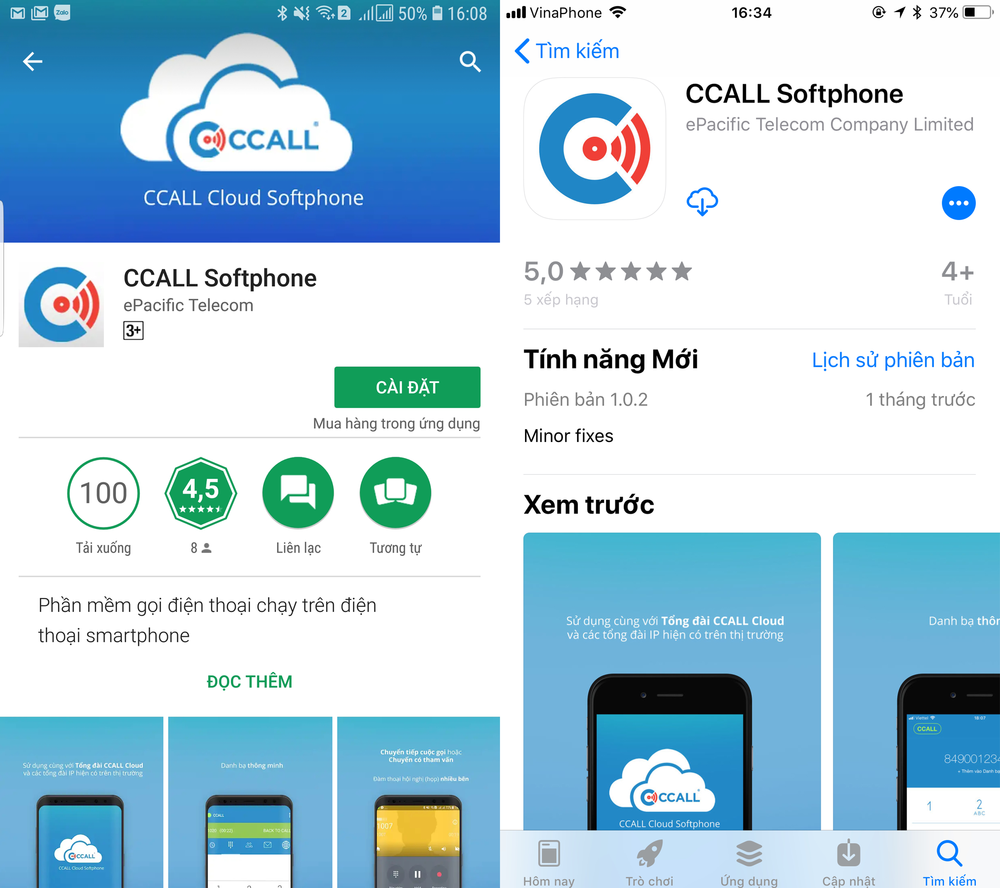
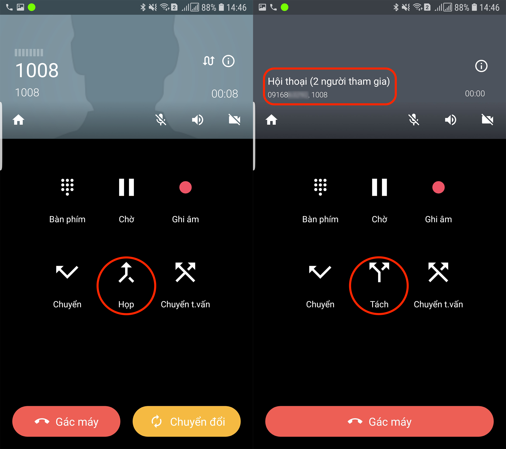
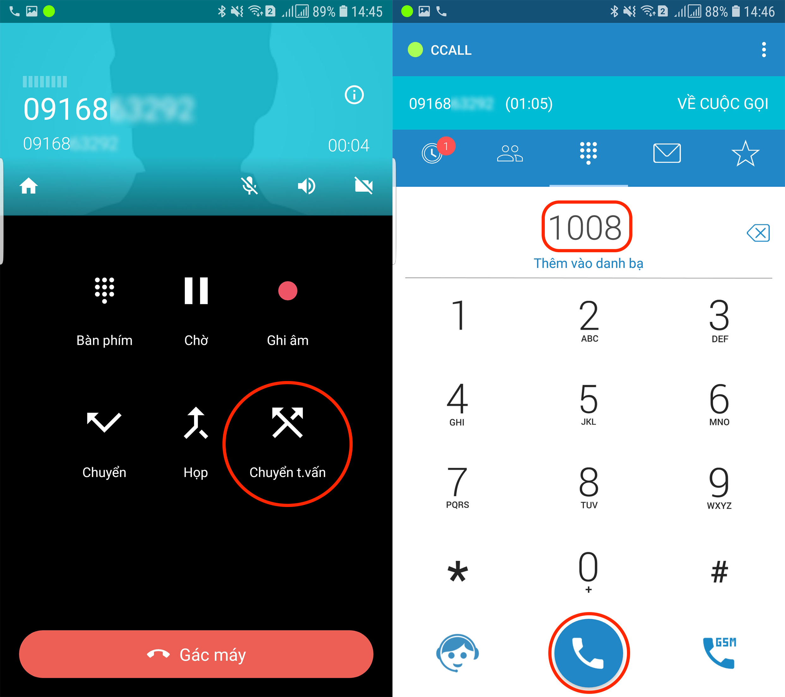
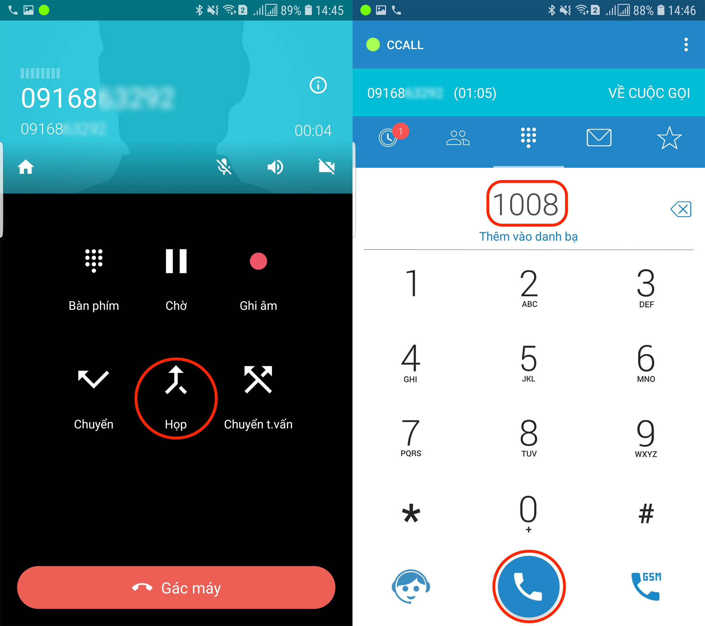

# Hướng dẫn sử dụng CCALL Softphone

Tài liệu hướng dẫn cài đặt và sử dụng CCALL Softphone cho khách hàng sử dụng tổng đài CCALL Cloud 

## Đăng ký

Nếu là lần đầu tiên sử dụng, bạn cần phải đăng ký tài khoản. Để đăng kí tài khoản, bạn làm như sau:

* Mở trình duyệt Chrome, Cốc Cốc, Firefox hoặc trình duyệt quen thuộc của bạn.
* Truy cập trang web [https://register.ccall.vn](https://register.ccall.vn/).
* Nhập thông tin của bạn vào để **Đăng ký**. Hệ thống sẽ gửi một tin nhắn vào số điện thoại bạn đã nhập chứa mã xác thực người dùng.

* Nhập mã xác thực người dùng để kích hoạt tài khoản của bạn.

* Nhấn tiếp tục, bạn cần nhập mật khẩu cho tài khoản của mình để đăng nhập trên CCALL Softphone.

* Nhấn tiếp tục, bạn đã hoàn thành việc đăng ký tài khoản của CCALL Softphone. Bây giờ bạn có thể đăng nhập và sử dụng dịch vụ.

## Đăng nhập

Nếu bạn đã đăng ký tài khoản sử dụng, bạn làm như sau:

### Cài đặt ứng dụng CCALL Softphone

* Truy cập **Google Play** [tại đây](https://play.google.com/store/apps/details?id=vn.ccall.android) cho máy **Android** hoặc truy cập **Appstore** [tại đây](https://itunes.apple.com/us/app/ccall-softphone/id1386720616?mt=8) cho máy **iOS**. 

* Nhấn **Start** để bắt đầu sử dụng CCALL Softphone. Nhập số điện thoại hoặc email cùng mật khẩu bạn đã đặt trước đó sau đó nhấn **Login**. 

* Chọn tài khoản cần kích hoạt như hình dưới và ấn **Activate** để kích hoạt tài khoản đó. 

* CCALL Softphone sẽ tải thông tin cầu hình của tài khoản và thực hiện cài đặt ứng dụng _\(bạn cần chờ đợi trong một vài phút để hoàn thành quá trình cài đặt\)_. Nhấn vào biểu tượng **gọi tổng đài viên** để kiểm thử cuộc gọi hoặc bạn có thể đăng ký thêm một tài khoản khác và gọi trực tiếp cho nhau thông qua hệ thống tổng đài test của CCALL Softphone. Bạn đã đăng ký tổng đài CCALL Cloud nhấn vào biểu tượng **Menu** để thêm cấu hình cho máy nhánh. 

* Nhấn **Cài đặt tài khoản** sau đó chọn **Edit Account** để thêm máy nhánh cho tổng đài CCALL Cloud của công ty bạn. 

* Chọn **Add SIP extension**, điền thông tin **máy nhánh nội bộ**, **mật khẩu máy nhánh** tương ứng, **domain tổng đài** của bạn. Sau đó nhấn **Save** để lưu lại thông tin máy nhánh nội bộ. `Lưu ý: Thông tin được CCALL Softphone gửi cho bạn thông qua email kích hoạt tài khoản khi bạn đăng ký sử dụng dịch vụ CCALL Cloud.`

* Nhấn kích hoạt máy nhánh nội bộ vừa thêm để sử dụng, trở về màn hình **Edit Account** bằng cách nhấn vào biểu tượng **Edit Account** như trên hình. 

* Lưu lại cấu hình để hoàn tất quá trình cài đặt, ngoài ra bạn có thể chọn **Tái thiết lập ứng dụng** để thoát hoàn toàn tài khoản CCALL Softphone. 

### Thực hiện cuộc gọi

### Chuyển cuộc gọi

#### Chuyển trực tiếp

#### Chuyển có thâm vấn

### Tạo phòng họp

### Ghi âm cuộc gọi

### Nhắn tin nội bộ

### DND
